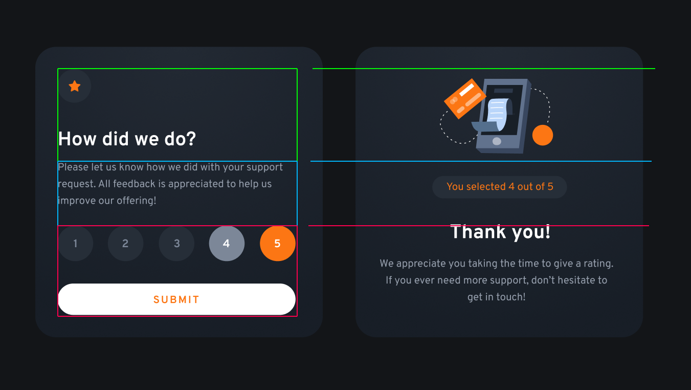

# Frontend Mentor - Interactive rating component solution

A solution provide by jefflangtech [Interactive rating component challenge on Frontend Mentor](https://www.frontendmentor.io/challenges/interactive-rating-component-koxpeBUmI).

## Table of contents

- [Overview](#overview)
  - [The challenge](#the-challenge)
  - [Screenshot](#screenshot)
  - [Links](#links)
- [My process](#my-process)
  - [Built with](#built-with)
  - [Step by step](#step-by-step)
  - [Continued development](#continued-development)
  - [Useful resources](#useful-resources)
- [Author](#author)


## Overview

### The challenge

Users should be able to:

- View the optimal layout for the app depending on their device's screen size
- See hover states for all interactive elements on the page
- Select and submit a number rating
- See the "Thank you" card state after submitting a rating

### Screenshot


Add a screenshot of your solution. The easiest way to do this is to use Firefox to view your project, right-click the page and select "Take a Screenshot". You can choose either a full-height screenshot or a cropped one based on how long the page is. If it's very long, it might be best to crop it.

Alternatively, you can use a tool like [FireShot](https://getfireshot.com/) to take the screenshot. FireShot has a free option, so you don't need to purchase it. 

Then crop/optimize/edit your image however you like, add it to your project, and update the file path in the image above.

### Links

- Solution URL: [Add solution URL here](https://your-solution-url.com)
- Live Site URL: [https://jefflangtech.github.io/rating-component/index.html](https://jefflangtech.github.io/rating-component/index.html)

## My process

### Built with

- Semantic HTML5 markup
- CSS custom properties
- Flexbox
- CSS Grid
- Mobile-first workflow

### Step by step

1. Initial setup (0:25)
2. Design system (0:17)
3. Notes on the layout (0:34)

**Notes**
It looks like the overall layout of the widget is broken into 3 primary sections, and each one of them can be their own div. Perhaps one is the header, which will contain the request for feedback heading prior to submission, and then the confirmation image after submission. Then a message div, and the rating div.

In the request state everything is either left aligned or spaced evenly, and the rating div can be flex. In the thank you state the content is centered.

For mobile everything is sized down a little bit but the overall layout stays the same so it should be really straight-forward to make this work.



The star and the rating selectors, 1-5, exist inside the same type of circular container. The only difference would be that the rating selectors have a hover state and a selected state. It looks like the 'selected' state is supposed to be grey and the hover state is orange. I think what I might do is have an inactive class and an activated class, where the inactive class has a hover state while the activated class does not, and each one of those has the correct corresponding color schemes. Then, on click, its just a class toggle while the rating score itself can be stored elsewhere.

As far as the form itself, I wonder if I just use an existing HTML structure with all the styling removed so that it exists behind the scenes? I think semantically that makes the most sense so I'll probably do radio buttons...yep I'm implementing that with a submit input as well.

Let's see if any of this backfires later 😂

4. Basic layout with styles (1:20)
  - Planning this all out in advance worked so well. Also using an image overlay of the design as a layer to compare against (I just turned it off and on using a visibility rule) was critical to getting close to pixel perfect
5. Create form and styles (0:33)
6. Program form functionality (3:34)
7. Program form response content creation (2:37)


To see how you can add code snippets, see below:

```html
<h1>Some HTML code I'm proud of</h1>
```
```css
.proud-of-this-css {
  color: papayawhip;
}
```
```js
const proudOfThisFunc = () => {
  console.log('🎉')
}
```

### Continued development

Use this section to outline areas that you want to continue focusing on in future projects. These could be concepts you're still not completely comfortable with or techniques you found useful that you want to refine and perfect.

### Useful resources

- [Example resource 1](https://www.example.com) - This helped me for XYZ reason. I really liked this pattern and will use it going forward.
- [Example resource 2](https://www.example.com) - This is an amazing article which helped me finally understand XYZ. I'd recommend it to anyone still learning this concept.

## Author

- Website - [JeffLangTech](https://jefflangtech.github.io/)
- Frontend Mentor - [@jefflangtech](https://www.frontendmentor.io/profile/jefflangtech)